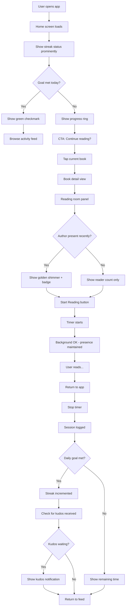

# UX Design Specification - flappy-bird-1

**Author:** vitr
**Date:** 2026-01-15

---

## Executive Summary

### Project Vision

A social reading platform that solves reader loneliness through ambient presence - the feeling of shared space without chat pressure. Core innovation: authors inhabit the same digital spaces as readers, creating magic through the *possibility* of connection rather than forced interaction.

### Target Users

| Persona | Need | Success Metric |
|---------|------|----------------|
| **Maya (Lonely Reader)** | Feel "not alone" while reading | Joins reading room in first week |
| **Theo (Indie Author)** | Know readers "GET" their work | Sees reader engagement metrics |
| **Habit Builders** | Accountability + social validation | 7-day streak completion |

### Key Design Challenges

1. **Presence without pressure** - Show others without surveillance feeling
2. **Streak anxiety mitigation** - Ethical gamification with flex days
3. **Empty room problem** - Never show naked zeros
4. **Speed to wow** - Under 2 minutes to first social proof
5. **Author presence discovery** - Magical, not creepy

### Design Opportunities

1. **"Anti-Goodreads" aesthetic** - Modern, clean, fast (learn from Hardcover)
2. **Peripheral awareness UI** - Soft presence dots, breathing animations
3. **Gentle notifications** - Toast-style author alerts, no sounds
4. **Immediate social proof** - Show presence on first book add
5. **One-tap social** - Kudos as effortless as Instagram double-tap

---

## Core User Experience

### Defining Experience

The core loop that drives daily engagement:

**Log session → See streak → Receive kudos → Feel validated**

The defining moment that differentiates this app:

**Entering a reading room and sensing others are there too**

Both habit (streaks) and presence (rooms) are equally critical - habit drives return visits, presence creates the emotional magic that makes this app unique.

### Platform Strategy

| Aspect | Decision |
|--------|----------|
| Primary platform | Web-first responsive (Next.js) |
| Mobile approach | PWA-optimized, feels like native app |
| Offline support | Session logging works offline, syncs when connected |
| Install prompt | Yes - encourage "Add to Home Screen" |

### Effortless Interactions

| Interaction | Target | Implementation |
|-------------|--------|----------------|
| Log reading session | One tap | Start/stop timer button |
| Give kudos | One tap | Double-tap or heart icon |
| Join reading room | Zero friction | Auto-visible from book page |
| See who's reading | Glanceable | Presence dots always visible |
| Add a book | Two taps max | Search + add button |

### Critical Success Moments

| Moment | User Feels | Design Priority |
|--------|------------|-----------------|
| First book add | "Others are reading this!" | Immediate social proof |
| First room join | Comfortable, not awkward | Ambient presence, no chat |
| First kudos received | Seen and validated | Gentle notification |
| First author presence | Magic, wonder | Gentle toast notification |
| 7-day streak | Accomplished, habit formed | Celebration without shame |

### Experience Principles

1. **Presence over chat** - Show others are here without requiring interaction
2. **One-tap everything** - Core actions take a single tap, never more
3. **Never feel alone** - Social proof visible at every touchpoint
4. **Habit rewards connection** - Streaks unlock social validation, not just badges
5. **Magic in possibility** - Author "was here" beats author "is watching"

---

## Desired Emotional Response

### Primary Emotional Goals

**Peak Emotion: Wonder**
The defining emotional moment is author presence - "The author was HERE." This creates wonder and delight that no competitor offers. Users should feel they're sharing space with creators they admire.

**Core Emotions: Belonging + Being Seen**
- Belonging: "I'm not reading alone" - reading rooms create ambient companionship
- Being Seen: "Someone noticed me" - kudos validate the reading journey

**Foundation Emotion: Pride**
Streak accomplishments create pride and habit formation, but serve as the engine that brings users back to experience the higher emotional moments.

### Emotional Hierarchy

```
                    🌟 WONDER (Author presence)
                         "The author is HERE"
                              ↑
                    ────────────────────
                   /                    \
          💜 BELONGING              💜 SEEN
          (Reading rooms)           (Kudos)
                   \                    /
                    ────────────────────
                              ↑
                    ✅ ACCOMPLISHMENT
                       (Streaks)
```

### Emotional Journey Map

| Stage | Primary Emotion | Design Implication |
|-------|-----------------|-------------------|
| First open | Curiosity + Hope | Warm onboarding, promise of connection |
| Add first book | Pleasant surprise | Immediate social proof |
| Join first room | Comfort + Belonging | Ambient presence, no chat pressure |
| First kudos | Validated + Seen | Gentle notification with sender |
| **Author presence** | **Wonder + Delight** | **Subtle reveal, magical moment** |
| 7-day streak | Pride | Celebration without over-the-top fanfare |
| Streak break | Forgiveness | Flex days, no shame messaging |
| Return visit | Anticipation | "Who's reading today?" |

### Micro-Emotions

**Design For:**

| Emotion | Priority | Why |
|---------|----------|-----|
| Wonder | Critical | Author presence differentiator |
| Belonging | High | Core value proposition |
| Being seen | High | Social validation loop |
| Calm | High | No chat pressure |
| Pride | Medium | Habit formation support |

**Actively Avoid:**

| Emotion | Risk | Mitigation |
|---------|------|------------|
| Surveillance | Presence feels like watching | Ambient dots, not active indicators |
| Performance anxiety | Streak pressure | Flex days, gentle language |
| Loneliness amplified | Empty rooms | Never show zero, use "was here" |
| FOMO | Missing streaks | Forgiveness-first messaging |

### Emotional Design Principles

1. **Wonder is the peak** - Design author presence as the emotional climax
2. **Ambient over active** - Presence should comfort, not demand
3. **Forgiveness over shame** - Broken streaks get compassion, not guilt
4. **Gentle over loud** - Notifications whisper, they don't shout
5. **Magic in restraint** - Author "was here" beats "is watching"

---

## UX Pattern Analysis & Inspiration

### Inspiring Products Analysis

| Product | Core Strength | Key Pattern |
|---------|--------------|-------------|
| **Duolingo** | Habit without shame | Streak ring + freeze mechanic |
| **Figma** | Ambient presence | Presence awareness (adapted) |
| **Strava** | Social validation | One-tap kudos, activity feed |
| **Instagram** | Effortless interaction | Double-tap, gentle feedback |
| **Hardcover** | Modern book UI | Clean visual hierarchy |

### Transferable UX Patterns

**Navigation Patterns:**
- Bottom tab navigation (mobile-first)
- Book as primary navigation anchor
- Persistent streak ring in header

**Interaction Patterns:**

| Pattern | Source | Our Adaptation |
|---------|--------|----------------|
| Streak ring + freeze | Duolingo | SVG ring with freeze toggle (MVP) |
| One-tap kudos | Strava/Instagram | Heart icon, optimistic UI |
| Presence indicators | Figma | **Mini avatars** (not dots) - avoids movement expectation |
| Author shimmer | Novel | Golden shimmer effect for author presence |

**Visual Patterns:**
- Book covers as hero images
- Mini avatar thumbnails for presence (first 5, then "+N more")
- Progress rings for streaks
- Warm color palette for belonging

**Feedback Patterns:**
- Gentle toast notifications (no sounds by default)
- Haptic feedback on kudos (mobile)
- Restrained celebration animations

### Anti-Patterns to Avoid

| Anti-Pattern | Why Avoid | Our Approach |
|--------------|-----------|--------------|
| Cursor-style dots | Creates movement expectation | Use mini avatars instead |
| Aggressive notifications | Erodes trust, causes anxiety | Gentle tone, user-controlled |
| Guilt-trip copy | "You'll lose your streak!" | "Your book is waiting" |
| Streaks without forgiveness | Creates the anxiety we're solving | Streak freeze is MVP |
| Chat-first social | Conflicts with ambient goal | Presence without chat |
| Real-time typing indicators | Performance pressure | No typing, just presence |

### Design Inspiration Strategy

**Adopt (MVP):**

| Pattern | Priority | Rationale |
|---------|----------|-----------|
| Streak ring + freeze | MVP | Ethical habit - can't ship one without other |
| One-tap kudos | MVP | Core social validation loop |
| Mini avatar presence | MVP | Differentiator, avoids Figma confusion |
| Author shimmer | MVP | Wonder moment - peak emotion |
| Activity feed | MVP | Social discovery glue |
| Clean book grid | MVP | Basic usability |

**Adapt:**

| Pattern | Adaptation |
|---------|------------|
| Figma presence | Static avatars, not moving cursors |
| Duolingo notifications | Gentle tone only, never guilt |
| Strava feed | Reading sessions, not workouts |

**Avoid:**

| Pattern | Reason |
|---------|--------|
| Duolingo notification aggression | Famously annoying |
| Algorithmic feeds | Users want authentic, chronological |
| Competitive leaderboards | Can demotivate casual readers |

---

## Design System Foundation

### Design System Choice

**Primary Stack:** Tailwind CSS + shadcn/ui + Framer Motion

| Component | Purpose |
|-----------|---------|
| **Tailwind CSS** | Utility-first styling, design tokens |
| **shadcn/ui** | Accessible, customizable base components |
| **Framer Motion** | Presence animations, micro-interactions |
| **Lucide Icons** | Consistent icon set (shadcn default) |

### Rationale for Selection

| Factor | How This Stack Addresses It |
|--------|----------------------------|
| Speed | Copy-paste components, no npm bloat |
| Customization | Own the code, full control over aesthetics |
| Warm aesthetic | Easy to define custom color palette |
| Animations | Framer Motion for gentle presence effects |
| Next.js compatibility | Built for App Router, RSC-ready |
| Dark mode | Built-in Tailwind dark mode support |
| Accessibility | shadcn/ui built on Radix primitives |

### Implementation Approach

**Design Tokens (tailwind.config.js):**

| Token Category | Purpose |
|----------------|---------|
| `colors.warm` | Warm palette for belonging emotions |
| `colors.author` | Golden accent for author presence shimmer |
| `colors.streak` | Success greens for streak celebrations |
| `borderRadius` | Rounded corners (friendlier feel) |
| `animation` | Gentle easing curves |

**Component Strategy:**

| Component Type | Approach |
|----------------|----------|
| Base UI (buttons, inputs) | shadcn/ui, customized |
| Presence avatars | Custom component |
| Streak ring | Custom SVG + Framer Motion |
| Author shimmer | Custom animation |
| Toast notifications | shadcn/ui toast, gentle styling |
| Book cards | Custom component |

**Animation Approach:**
- Framer Motion for enter/exit transitions
- CSS transitions for hover states
- Gentle easing curves (no harsh movements)
- Pulse animations for presence indicators

### Customization Strategy

**Brand Differentiation:**
1. Custom warm color palette (not default shadcn grays)
2. Rounded corners (friendlier than sharp)
3. Soft shadows (depth without harshness)
4. Custom presence indicator component
5. Golden shimmer effect for author moments

**What We'll Customize:**
- Color tokens for warmth and belonging
- Border radius (more rounded = friendlier)
- Animation timing (slower = calmer)
- Toast styling (gentler than defaults)
- Avatar component (mini presence indicators)

**What We'll Keep Default:**
- Accessibility primitives
- Focus states
- Keyboard navigation
- Form validation patterns

---

## Defining Core Experience

### The Defining Experience Statement

> "It's like reading in a library where sometimes the author walks in."

**Two-Part Hook:**
1. **Daily habit:** Log reading sessions, maintain streak
2. **Magic moment:** Sense others reading alongside you - especially authors

### User Mental Model

**Current Model (to challenge):**

| Current Belief | Our Reframe |
|----------------|-------------|
| "Tracking = finished books" | Tracking = the reading journey |
| "Social = reviews and chat" | Social = silent presence |
| "Authors = unreachable" | Authors = inhabitants of shared space |

**Familiar Metaphor:**
"A library study hall where you see who else is there, and sometimes the author's name appears on the sign-in sheet."

### Success Criteria

| Criteria | Target | User Feeling |
|----------|--------|--------------|
| Presence awareness | <1 sec to see room occupants | "I'm not alone" |
| Session logging | One tap | "This is easy" |
| Kudos feedback | <5 sec notification | "Someone saw me" |
| Author moment | Shimmer + gentle toast | "The AUTHOR is here?" |

### Novel UX Patterns

**Patterns We're Inventing:**

1. **Ambient Reading Room**
   - Show who's reading without chat
   - Mini avatars with gentle pulse
   - No obligation to interact

2. **Author "Was Here" Indicator**
   - Golden shimmer effect on author presence
   - Timestamp: "Author was here 3 hours ago"
   - Live toast when author joins

**Teaching the Pattern:**
- Onboarding tooltip: "See who else is reading"
- First room join: Highlight presence indicators
- First author moment: Slightly longer toast display

### Experience Mechanics

**Reading Room Flow:**

| Step | Action | Response |
|------|--------|----------|
| 1 | Tap current book | Book page with room visible |
| 2 | See "4 readers here" | Mini avatars pulse gently |
| 3 | Join room (auto or tap) | User avatar appears |
| 4 | Read (app backgrounded OK) | Presence maintained 30 min |
| 5 | Tap "Done" | Session logged, streak updated |

**Author Presence Flow:**

| Step | Trigger | Response |
|------|---------|----------|
| 1 | Room loads | Check for recent author activity |
| 2 | Author visited <24h | Golden shimmer on badge |
| 3 | User hovers/taps | "Author was here 3 hours ago" |
| 4 | Author joins live | Gentle toast notification |

---

## Visual Design Foundation

### Color System - "Warm Hearth"

**Design Philosophy:** Earth tones and amber accents create a cozy, inviting atmosphere that supports feelings of belonging and warmth. The golden author shimmer is our signature moment - visually ownable and competitively unique.

**Primary Palette:**

| Role | Color | Hex |
|------|-------|-----|
| Primary | Warm Amber | `#d97706` |
| Primary Light | Soft Peach | `#fcd34d` |
| Secondary | Terracotta | `#c2410c` |
| Background | Warm Cream | `#fffbeb` |
| Surface | Soft White | `#fefce8` |
| Text | Warm Brown | `#451a03` |
| Text Muted | Dusty Brown | `#78350f` |

**Semantic Colors:**

| Role | Color | Hex | Notes |
|------|-------|-----|-------|
| Author Shimmer | Rich Gold | `#eab308` | Decorative glow effect |
| Author Text | Dark Amber | `#92400e` | Accessible text (12.8:1) |
| Streak/Success | Forest Green | `#16a34a` | Accomplishments |
| Kudos/Social | Warm Coral | `#f97316` | Hearts, social actions |
| Presence | Soft Amber | `#fbbf24` | Presence indicator pulse |
| Warning | Burnt Orange | `#ea580c` | Gentle warnings |
| Error | Clay Red | `#dc2626` | Errors (rare) |

**Dark Mode:**

| Role | Light | Dark |
|------|-------|------|
| Background | `#fffbeb` | `#1c1917` |
| Surface | `#fefce8` | `#292524` |
| Text | `#451a03` | `#e7e5e4` (muted for eye comfort) |
| Primary | `#d97706` | `#fbbf24` |
| Author shimmer | `#eab308` | `#facc15` |

**Signature Moment - Author Presence:**
When author presence is detected, the entire book card receives a subtle golden border glow. The room "gets warmer" when the author is there - this is our ownable, memorable visual moment that no competitor has.

### Typography System

**Font Stack:** Inter (primary), system fonts (fallback)

| Level | Size | Weight | Usage |
|-------|------|--------|-------|
| Display | 36px | 700 | Hero sections |
| H1 | 30px | 600 | Page titles |
| H2 | 24px | 600 | Section headers |
| H3 | 20px | 600 | Card titles |
| Body | 16px | 400 | Default text |
| Small | 14px | 400 | Secondary text |
| Caption | 12px | 500 | Labels, timestamps |

### Spacing & Layout

**Spacing Scale:** 4px base unit

| Token | Value | Usage |
|-------|-------|-------|
| xs | 4px | Tight gaps |
| sm | 8px | Icon padding |
| md | 16px | Default padding |
| lg | 24px | Section gaps |
| xl | 32px | Large gaps |
| 2xl | 48px | Page sections |

**Layout Principles:**
- Airy, generous whitespace for calm feeling
- Card-based UI with soft shadows
- Mobile-first with bottom navigation
- 44px minimum touch targets

**Border Radius:**
- Buttons: 8px (friendly)
- Cards: 12px (soft, inviting)
- Avatars: Full circle
- Modals: 16px

### Accessibility

| Requirement | Standard |
|-------------|----------|
| Color contrast | WCAG AA (4.5:1 minimum) |
| Touch targets | 44x44px minimum |
| Focus indicators | 2px primary ring |
| Reduced motion | Respects `prefers-reduced-motion` |
| Min font size | 12px (body 16px) |
| Dark mode text | Muted cream for eye comfort |

### Competitive Differentiation

No major competitor uses warm amber as primary palette:
- Goodreads: Brown (dated)
- StoryGraph: Teal/Purple (cool)
- Fable: Purple (corporate)
- Hardcover: Blue (cold)

**"Warm Hearth" is visually ownable and immediately differentiating.**

---

## Design Direction Decision

### Design Directions Explored

Four distinct visual approaches were created and evaluated in `ux-design-directions.html`:

| Direction | Approach | Key Strength | Key Trade-off |
|-----------|----------|--------------|---------------|
| **1. Cozy Minimal** | Spacious cards, Instagram-like simplicity | Maximum calm, easy to scan | Less information density |
| **2. Dense Library** | Grid-based, StoryGraph-like density | See more books at once | Less calm, smaller touch targets |
| **3. Feed-Forward** | Activity feed primary, Twitter/Strava style | Maximizes social engagement | Less book-focused, may feel noisy |
| **4. Book-Centric** | Hero book cover, immersive room view | Book as star, room feels central | One book at a time view |

### Chosen Direction

**Hybrid: Cozy Minimal (D1) + Book-Centric Elements (D4)**

The primary approach combines:
- **From Direction 1:** Spacious card layout, generous whitespace, calm aesthetic, bottom navigation
- **From Direction 4:** Reading room prominence when viewing a book, author shimmer showcase, immersive book detail view

### Design Rationale

| Factor | Decision | Why |
|--------|----------|-----|
| Primary layout | Cozy Minimal cards | Supports "calm" and "belonging" emotional goals |
| Book detail view | Book-Centric hero | Creates immersive reading room experience |
| Information density | Low-medium | Prioritizes calm over feature density |
| Navigation | Bottom tab bar | Mobile-first, familiar pattern |
| Author presence | D4's shimmer toast + D1's badge | Peak emotional moment needs maximum visibility |
| Social signals | Mini avatar presence (D1 style) | Ambient without surveillance feeling |

**Why Not Other Directions:**
- **Dense Library (D2):** Conflicts with calm emotional goal; presence indicators too small
- **Feed-Forward (D3):** Makes social the primary focus when books should be; risks feeling like "yet another social app"

### Implementation Approach

**Home Screen:** Direction 1 (Cozy Minimal)
- Streak ring in header
- Card-based "Currently Reading" with presence indicators
- Book list with author badges visible

**Book Detail/Reading Room:** Direction 4 (Book-Centric)
- Hero book cover with gradient background
- Reading room panel with mini avatars
- Author shimmer effect when author present
- Toast notification for live author joins

**Activity Feed:** Simplified Direction 3 elements
- Chronological feed (not algorithmic)
- Kudos and reading session updates
- Author posts highlighted with shimmer

**Library View:** Direction 1 card style (not D2 grid)
- Vertical scrolling book cards
- Presence visible on each card
- Author presence badges

---

## User Journey Flows

### Journey 1: New Reader Onboarding to First Streak

**Goal:** Get new user from signup to first successful reading session and streak start.

```mermaid
flowchart TD
    A[User lands on app] --> B{Has account?}
    B -->|No| C[Show signup options]
    B -->|Yes| D[Login screen]

    C --> E[Google/Apple OAuth]
    E --> F[Create profile]
    F --> G[Set reading goal]

    D --> H[Enter credentials]
    H --> I{Auth success?}
    I -->|No| J[Show error, retry]
    J --> D
    I -->|Yes| K[Home screen]

    G --> K

    K --> L[Prompt: Add your first book]
    L --> M[Book search]
    M --> N[Select book]
    N --> O[Add to "Currently Reading"]
    O --> P[Show book card with presence]

    P --> Q{Others in room?}
    Q -->|Yes| R[Show: "4 readers here now"]
    Q -->|No| S[Show: "Be the first reader!"]

    R --> T[Join Reading Room button]
    S --> T

    T --> U[Enter reading room]
    U --> V[Show presence indicators]
    V --> W[Start timer]
    W --> X[User reads...]
    X --> Y[Stop timer]
    Y --> Z[Log session]

    Z --> AA{Goal met?}
    AA -->|Yes| AB[Streak: Day 1!]
    AA -->|No| AC[Progress shown, encourage more]

    AB --> AD[Celebration animation]
    AD --> AE[Return to home]
    AC --> AE
```

**Key Decision Points:**
- Reading goal selection (5/15/30 min defaults)
- Book search results (prioritize presence count)
- Session end timing (allow manual stop)

**Error Recovery:**
- OAuth failure → Retry with clear message
- Book not found → Manual add option
- Session not logged → Local storage backup, sync later

---

### Journey 2: Daily Reading Habit Loop

**Goal:** Returning user maintains streak with minimal friction.



**Optimization for Speed:**
- Home → reading in 2 taps maximum
- Timer starts immediately on room entry
- Background presence maintained for 30 min

---

### Journey 3: Giving and Receiving Kudos

**Goal:** Social validation loop that feels effortless and rewarding.

```mermaid
flowchart TD
    A[User views activity feed] --> B[See friend's reading session]
    B --> C[Session card shows book + time]

    C --> D{Want to give kudos?}
    D -->|Yes| E[Tap heart / double-tap card]
    D -->|No| F[Scroll to next item]

    E --> G[Optimistic UI - heart fills]
    G --> H[Haptic feedback]
    H --> I[Kudos saved to server]

    I --> J{Save success?}
    J -->|Yes| K[Done - continue browsing]
    J -->|No| L[Retry silently]

    subgraph Receiver Experience
        M[User receives kudos] --> N[Toast notification appears]
        N --> O[Shows: "Sarah sent kudos!"]
        O --> P[Badge on notifications tab]
        P --> Q[Tap to see details]
        Q --> R[Which session received kudos]
    end

    K --> F
    L --> K
```

**Interaction Design:**
- Double-tap anywhere on session card = kudos
- Single-tap heart icon = kudos
- Long-press = additional options (future)

---

### Journey 4: Author Claims Book & Engages

**Goal:** Author goes from discovery to first reader interaction.

```mermaid
flowchart TD
    A[Author receives email/notification] --> B[Clicks link to app]
    B --> C{Has account?}

    C -->|No| D[Signup flow]
    C -->|Yes| E[Login]

    D --> F[Author profile setup]
    F --> G[Search for their book]

    E --> G

    G --> H[Book found in system]
    H --> I[Claim as Author button]
    I --> J[Verification flow]

    J --> K{Verification method}
    K -->|Amazon link| L[Paste author page URL]
    K -->|Social proof| M[Link Twitter/website]
    K -->|Manual| N[Submit for review]

    L --> O[Auto-verification]
    M --> O
    N --> P[Pending review queue]

    O --> Q{Verified?}
    Q -->|Yes| R[Author badge granted]
    Q -->|No| P

    P --> S[Admin reviews]
    S --> Q

    R --> T[View reader metrics]
    T --> U[See: "7 readers this week"]
    U --> V[See reading room]

    V --> W[Join room as author]
    W --> X[Golden badge appears]
    X --> Y[Readers see shimmer effect]
    Y --> Z[Toast: "Author joined!"]

    Z --> AA[Author can give kudos to readers]
    AA --> AB[Reader receives author kudos]
    AB --> AC[Peak emotional moment!]
```

**Author-Specific UI:**
- Dashboard shows reader engagement metrics
- Room entry triggers notifications to current readers
- Author badge with shimmer distinguishes presence

---

### Journey 5: Streak Freeze & Recovery

**Goal:** Prevent habit-breaking anxiety while maintaining accountability.

```mermaid
flowchart TD
    A[User misses daily goal] --> B{End of day?}
    B -->|No| C[Still time - show CTA]
    B -->|Yes| D{Has streak freeze?}

    D -->|Yes| E[Auto-apply freeze option]
    D -->|No| F[Streak at risk warning]

    E --> G{User confirms freeze?}
    G -->|Yes| H[Freeze used - streak protected]
    G -->|No| I[Streak resets to 0]

    F --> J[Gentle message: "Tomorrow is a new day"]
    I --> J

    J --> K[Streak counter resets]
    K --> L[Show: "Start fresh - Day 1"]

    H --> M[Show: "Streak saved with freeze"]
    M --> N[Freeze count decremented]
    N --> O[Continue tomorrow]

    subgraph Earning Freezes
        P[Complete 7-day streak] --> Q[Earn 1 freeze]
        R[Complete 30-day streak] --> S[Earn 3 freezes]
        T[Max 5 freezes stored]
    end
```

**Emotional Design:**
- Never use guilt language ("You lost your streak!")
- Focus on fresh starts ("Tomorrow is Day 1")
- Freeze is presented as reward, not safety net

---

### Journey Patterns

**Common Navigation Patterns:**

| Pattern | Usage | Implementation |
|---------|-------|----------------|
| Bottom tab bar | Primary navigation | 5 tabs: Home, Search, Library, Activity, Profile |
| Pull to refresh | Update feeds/rooms | Standard gesture, subtle loading indicator |
| Swipe back | Return to previous | iOS-style navigation stack |
| Tap to expand | Card details | Inline expansion or modal |

**Common Decision Patterns:**

| Pattern | Usage | Implementation |
|---------|-------|----------------|
| Single-tap action | Kudos, join room | Immediate feedback, optimistic UI |
| Confirm destructive | Remove book, reset streak | Modal with clear consequences |
| Undo available | Most actions | Toast with undo button (5 sec window) |

**Common Feedback Patterns:**

| Pattern | Usage | Implementation |
|---------|-------|----------------|
| Optimistic UI | Kudos, session log | Show success immediately, sync async |
| Toast notification | Kudos received, author join | Slide in, auto-dismiss 4 sec |
| Progress indicators | Streak ring, reading timer | Animated, real-time update |
| Celebration | Streak milestone | Subtle confetti, no sound default |

---

### Flow Optimization Principles

1. **Two-Tap Maximum** - Core actions (start reading, give kudos) complete in 2 taps
2. **Always Recoverable** - Every action can be undone or recovered from error
3. **Progress Visible** - User always knows where they stand (streak, goal, position)
4. **Async Friendly** - UI responds immediately, syncs in background
5. **Graceful Degradation** - Offline works for reading, syncs when connected

---

## Component Strategy

### Design System Components (shadcn/ui)

**Available Components to Use:**

| Category | Components | Usage |
|----------|-----------|-------|
| **Layout** | Card, Separator, ScrollArea | Book cards, content sections |
| **Navigation** | Tabs, NavigationMenu | Bottom nav, library tabs |
| **Forms** | Button, Input, Label, Select | Search, settings, forms |
| **Feedback** | Toast, Skeleton, Progress | Notifications, loading states |
| **Overlay** | Dialog, Sheet, Popover | Modals, bottom sheets |
| **Data Display** | Avatar, Badge | User profiles, author badges |

**Customization Required:**

| Component | Customization | Rationale |
|-----------|--------------|-----------|
| Button | Warm amber primary color | Brand alignment |
| Card | Increased border-radius, soft shadows | Cozy feel |
| Avatar | Stacked variant for presence | Reading room display |
| Toast | Left border accent, gentler animation | Author presence alerts |
| Badge | Golden shimmer variant | Author distinction |

---

### Custom Components

#### 1. StreakRing

**Purpose:** Visual representation of daily reading goal progress and streak count.

**Anatomy:**
- Circular SVG ring with animated fill
- Center number showing streak days
- Color states: incomplete (amber), complete (green), frozen (blue)

**States:**

| State | Appearance | Trigger |
|-------|------------|---------|
| Default | Amber ring, partial fill | Goal not yet met |
| Complete | Green ring, full fill, checkmark | Daily goal achieved |
| Frozen | Blue ring, snowflake icon | Freeze day active |
| Milestone | Confetti animation | 7, 30, 100 day milestones |

**Variants:**
- `size="sm"` (32px) - Header, compact views
- `size="md"` (48px) - Profile, cards
- `size="lg"` (80px) - Home hero, celebrations

**Accessibility:**
- `aria-label="Reading streak: X days, Y minutes of Z goal completed today"`
- `role="progressbar"` with `aria-valuenow`, `aria-valuemin`, `aria-valuemax`

---

#### 2. PresenceAvatarStack

**Purpose:** Show who's in a reading room with stacked mini avatars.

**Anatomy:**
- Overlapping circular avatars (28px)
- "+N" overflow indicator
- Optional author shimmer ring
- Online indicator dots

**States:**

| State | Appearance | Trigger |
|-------|------------|---------|
| Empty | "Be the first!" text | No readers in room |
| Few (1-5) | All avatars visible | Small room |
| Many (6+) | 5 avatars + "+N more" | Larger room |
| Author Present | Golden shimmer on author avatar | Author in room |

**Props:**
- `users: User[]` - Array of users to display
- `max: number` - Max avatars before overflow (default 5)
- `showAuthor: boolean` - Highlight author if present
- `size: "sm" | "md"` - Avatar size variant

**Accessibility:**
- `aria-label="X readers in this room"` (includes author if present)
- Focusable to see full reader list

---

#### 3. BookCard

**Purpose:** Primary display for books in lists, home, and library views.

**Anatomy:**
- Book cover image (with fallback)
- Title and author text
- Progress indicator (if currently reading)
- Presence indicator (mini avatar stack)
- Author badge (if author claimed)
- Kudos/interaction buttons

**States:**

| State | Appearance | Trigger |
|-------|------------|---------|
| Default | Standard card | Normal display |
| Author Present | Golden border glow | Author active in last 24h |
| Currently Reading | Progress bar visible | Book in "reading" status |
| Hover | Subtle elevation | Mouse hover |
| Focused | Primary outline | Keyboard focus |

**Variants:**
- `variant="compact"` - List view, minimal info
- `variant="expanded"` - Home view, full details
- `variant="hero"` - Book detail page header

**Accessibility:**
- Semantic heading for book title
- Alt text for cover images
- Focusable with keyboard navigation

---

#### 4. AuthorShimmerBadge

**Purpose:** Visual indicator of author presence with magical shimmer effect.

**Anatomy:**
- Golden background with animated shimmer
- "Author" or author name text
- Sparkle icon
- Timestamp ("was here 3h ago")

**States:**

| State | Appearance | Trigger |
|-------|------------|---------|
| Was Here | Static golden badge | Author visited in last 24h |
| Live | Animated shimmer pulse | Author currently in room |
| Claimed | Subtle golden accent | Author claimed but not active |

**Animation:**
- Shimmer: CSS gradient animation, 2s duration, ease-in-out
- Respects `prefers-reduced-motion`

**Accessibility:**
- `aria-label="Author [name] was here [time]"` or "Author [name] is here now"
- Screen reader announces author presence on room entry

---

#### 5. SessionTimer

**Purpose:** Track and display active reading session with start/stop controls.

**Anatomy:**
- Large time display (MM:SS or HH:MM:SS)
- Start/Stop button
- Goal progress indicator
- Pause/resume (optional)

**States:**

| State | Appearance | Trigger |
|-------|------------|---------|
| Ready | "Start Reading" button | Not yet started |
| Active | Running timer, "Stop" button | Session in progress |
| Paused | Paused indicator, "Resume" | User paused (future) |
| Complete | Success checkmark, time logged | Session ended |
| Goal Met | Celebration indicator | Daily goal achieved |

**Behavior:**
- Works in background (browser backgrounded)
- Persists across page navigation
- Auto-saves progress every 30 seconds

**Accessibility:**
- `aria-live="polite"` for timer updates
- Clear button labels for screen readers

---

#### 6. KudosButton

**Purpose:** One-tap social validation with delightful feedback.

**Anatomy:**
- Heart icon
- Count display
- Animation container

**States:**

| State | Appearance | Trigger |
|-------|------------|---------|
| Default | Empty heart outline | Not yet given kudos |
| Given | Filled heart, coral color | User gave kudos |
| Animating | Heart scale + particles | Kudos just given |
| Received | Heart with "+1" badge | Receiving kudos |

**Interaction:**
- Single tap = give kudos
- Double-tap on card = give kudos (alternative)
- Haptic feedback on mobile

**Accessibility:**
- `aria-label="Give kudos"` or "You gave kudos"
- `aria-pressed` for toggle state

---

#### 7. ActivityFeedItem

**Purpose:** Display reading sessions and milestones in activity feed.

**Anatomy:**
- User avatar and name
- Timestamp
- Activity description
- Book reference (if applicable)
- Kudos button
- Presence indicator (optional)

**Variants:**
- `type="session"` - Reading session completed
- `type="finished"` - Book finished
- `type="milestone"` - Streak milestone
- `type="author"` - Author activity (shimmer styling)

**States:**
- Default, New (unread indicator), Interacted (kudos given)

---

#### 8. ReadingRoomPanel

**Purpose:** Display reading room state within book detail view.

**Anatomy:**
- Room title/book reference
- Presence avatar stack
- Reader count badge
- Author presence indicator
- Join/Leave button
- Timer (if in room)

**States:**

| State | Appearance | Trigger |
|-------|------------|---------|
| Preview | Avatar stack, "Join" button | Not in room |
| Joined | Full panel, timer, "Leave" | User in room |
| Author Live | Golden border, toast | Author joined |

---

### Component Implementation Strategy

**Build Order Priority:**

| Phase | Components | Rationale |
|-------|------------|-----------|
| **P1: Core** | StreakRing, BookCard, SessionTimer | Critical path for MVP habit loop |
| **P1: Core** | KudosButton, ActivityFeedItem | Social validation loop |
| **P2: Social** | PresenceAvatarStack, ReadingRoomPanel | Differentiating co-presence features |
| **P2: Social** | AuthorShimmerBadge | Peak emotional moment |
| **P3: Polish** | Toast customization, animations | Delight and brand consistency |

**Implementation Approach:**

1. **Composition over inheritance** - Build complex components from shadcn primitives
2. **Design tokens first** - Define warm palette tokens before building
3. **Animation library** - Use Framer Motion for consistent micro-interactions
4. **Accessibility built-in** - ARIA labels and keyboard nav from day one
5. **Storybook documentation** - Document all states and variants

**Code Structure:**

```
components/
├── ui/                    # shadcn/ui components (customized)
│   ├── button.tsx
│   ├── card.tsx
│   └── ...
├── features/              # Custom feature components
│   ├── streak-ring.tsx
│   ├── book-card.tsx
│   ├── session-timer.tsx
│   ├── kudos-button.tsx
│   ├── presence-avatar-stack.tsx
│   ├── author-shimmer-badge.tsx
│   ├── activity-feed-item.tsx
│   └── reading-room-panel.tsx
└── layout/               # Layout components
    ├── bottom-nav.tsx
    └── page-header.tsx
```

---

### Implementation Roadmap

**Week 1-2: Foundation**
- Set up Tailwind config with warm palette tokens
- Install and customize shadcn/ui base components
- Create StreakRing component (critical for habit loop)
- Create SessionTimer component (core functionality)

**Week 2-3: Core Features**
- Create BookCard component (primary content display)
- Create KudosButton with optimistic UI
- Create ActivityFeedItem for social feed
- Implement bottom navigation

**Week 3-4: Differentiation**
- Create PresenceAvatarStack for reading rooms
- Create ReadingRoomPanel for book detail
- Create AuthorShimmerBadge for peak emotional moment
- Add Framer Motion animations

**Week 4+: Polish**
- Refine animations and micro-interactions
- Add haptic feedback (mobile)
- Accessibility audit and fixes
- Performance optimization

---

## UX Consistency Patterns

### Button Hierarchy

**Button Types:**

| Type | Usage | Visual Style |
|------|-------|--------------|
| **Primary** | Main action per screen | Amber fill, white text |
| **Secondary** | Alternative actions | Amber outline, amber text |
| **Ghost** | Tertiary, navigation | No border, amber text |
| **Destructive** | Delete, remove actions | Red fill or outline |

**Button States:**

| State | Visual Change | Behavior |
|-------|--------------|----------|
| Default | Full opacity | Ready for interaction |
| Hover | Slight darken | Indicates interactivity |
| Active | Pressed scale (95%) | Visual confirmation |
| Disabled | 50% opacity | Non-interactive |
| Loading | Spinner + disabled | Processing |

**Button Rules:**
1. One primary button per view/section
2. Primary button placement: bottom-right (forms), bottom-center (CTAs)
3. Minimum touch target: 44x44px
4. Always show loading state for async actions
5. Disabled buttons show tooltip explaining why

---

### Feedback Patterns

**Success Feedback:**

| Trigger | Response | Duration |
|---------|----------|----------|
| Session logged | Toast + streak update | 4 sec |
| Kudos sent | Heart animation + haptic | 1 sec |
| Book added | Card slides in + toast | 3 sec |
| Goal achieved | Celebration animation | 3 sec |

**Error Feedback:**

| Trigger | Response | Recovery |
|---------|----------|----------|
| Network error | Toast with retry button | Retry action |
| Validation error | Inline field message | Focus field |
| Auth failure | Toast + redirect to login | Re-authenticate |
| Server error | Toast with support link | Report issue |

**Warning Feedback:**

| Trigger | Response | Action |
|---------|----------|--------|
| Streak at risk | Gentle toast | "Read now" CTA |
| Session timeout | Modal dialog | Resume or save |
| Destructive action | Confirmation modal | Confirm/cancel |

**Toast Patterns:**

| Type | Icon | Color | Position |
|------|------|-------|----------|
| Success | Checkmark | Green accent | Top center |
| Error | X circle | Red accent | Top center |
| Warning | Alert | Amber accent | Top center |
| Info | Info | Blue accent | Top center |
| Author | Sparkle | Gold accent + shimmer | Top center |

**Toast Behavior:**
- Auto-dismiss: 4 seconds (configurable)
- Swipe to dismiss
- Stack max 3, queue others
- Pause on hover/focus

---

### Form Patterns

**Input States:**

| State | Border | Background | Label |
|-------|--------|------------|-------|
| Default | Gray | White | Above field |
| Focused | Primary amber | White | Floats/stays |
| Error | Red | Light red | Red label |
| Disabled | Light gray | Gray | Muted |
| Success | Green | White | Green checkmark |

**Validation Approach:**
1. Validate on blur (not keystroke)
2. Show inline error below field
3. Use helpful, not critical language
4. Provide examples where helpful

**Form Submission:**
- Disable submit until valid
- Show loading state on submit
- Optimistic UI for simple actions
- Error recovery keeps form data

**Search Pattern:**

| State | Behavior |
|-------|----------|
| Empty | Placeholder text, clear scope |
| Active | Debounced search (300ms) |
| Results | Grouped by type (books, users) |
| No results | Helpful message + suggestions |
| Loading | Skeleton results |

---

### Navigation Patterns

**Bottom Tab Bar:**

| Tab | Icon | Label | Badge |
|-----|------|-------|-------|
| Home | House | Home | None |
| Search | Magnifier | Search | None |
| Library | BookOpen | Library | Unread count |
| Activity | Bell | Activity | New count |
| Profile | User | Profile | Streak indicator |

**Navigation Behavior:**
- Active tab: filled icon, primary color
- Inactive tab: outline icon, muted color
- Badge: red dot or count
- Tap active tab: scroll to top

**Page Transitions:**
- Push: slide left (going deeper)
- Pop: slide right (going back)
- Modal: slide up
- Duration: 200ms, ease-out

**Header Pattern:**
- Left: back arrow (if navigable)
- Center: page title
- Right: contextual action (settings, share)
- Scroll behavior: sticky header

---

### Empty State Patterns

**Design Principle:** Never show empty, always guide.

| Context | Message | Action |
|---------|---------|--------|
| No books | "Start your reading journey" | "Add a book" button |
| No activity | "Follow readers to see activity" | "Find readers" button |
| No kudos | "Your kudos will appear here" | Explanation text |
| Empty room | "Be the first to read here!" | "Start Reading" button |
| No results | "No books found for '[query]'" | "Try different search" |

**Empty State Components:**
- Friendly illustration (optional)
- Short, encouraging headline
- Brief explanation
- Single CTA button

---

### Loading State Patterns

**Skeleton Loading:**
- Use for content-heavy areas (feed, library)
- Match content layout shape
- Subtle pulse animation
- Duration: show after 200ms delay

**Inline Loading:**
- Spinner inside button for actions
- Small indicator for async updates
- Never block entire screen for small actions

**Full Page Loading:**
- Only for initial app load
- Show logo + progress indicator
- Keep under 3 seconds

---

### Microinteraction Patterns

**Kudos Interaction:**

```
1. User taps heart
2. Optimistic: heart fills immediately
3. Animation: scale 1.2x → 1.0x (150ms)
4. Particles: small hearts float up (optional)
5. Haptic: light tap (mobile)
6. Sound: none (by default)
```

**Streak Ring Interaction:**

```
1. Goal progress updates
2. Ring fills smoothly (animation 500ms)
3. On completion: ring turns green
4. Checkmark fades in
5. Subtle confetti (milestone only)
```

**Author Presence Reveal:**

```
1. Author joins room
2. Toast slides down (gold border)
3. Avatar in room gets shimmer effect
4. Panel border animates gold glow
5. Effect persists while author present
```

**Pull to Refresh:**

```
1. User pulls down
2. Resistance increases near threshold
3. At threshold: spinner appears
4. Release: refresh triggers
5. Content updates: spinner hides
```

---

### Modal & Overlay Patterns

**Modal Dialog:**
- Centered, max-width 400px
- Dark overlay (50% opacity)
- Focus trap inside modal
- Escape key closes
- Click outside closes (optional)

**Bottom Sheet:**
- Slides up from bottom
- Drag handle at top
- Swipe down to close
- Max height: 90% viewport

**Popover:**
- Anchored to trigger element
- Arrow points to trigger
- Click outside closes
- Max-width: 300px

**When to Use:**

| Pattern | Use Case |
|---------|----------|
| Modal | Confirmations, important choices |
| Bottom Sheet | Mobile actions, filters |
| Popover | Tooltips, quick info |
| Toast | Feedback, notifications |

---

### Consistency Rules Summary

1. **One primary action** per screen/section
2. **Instant feedback** for all user actions
3. **Optimistic UI** for social actions (kudos, follow)
4. **Graceful degradation** when offline
5. **Never empty** - always guide to next action
6. **Gentle language** - encourage, don't guilt
7. **Respect motion preferences** - reduce for a11y
8. **Touch targets** - minimum 44px
9. **Loading states** - skeleton over spinners
10. **Gold for authors** - consistent shimmer treatment

---

## Responsive Design & Accessibility

### Responsive Strategy

**Platform Approach:** Mobile-first responsive web application (PWA)

| Platform | Priority | Strategy |
|----------|----------|----------|
| **Mobile (Primary)** | P0 | Native-feel PWA, bottom navigation, touch-optimized |
| **Tablet** | P1 | Adaptive layouts, same navigation paradigm |
| **Desktop** | P2 | Enhanced layouts, keyboard shortcuts, hover states |

**Mobile-First Rationale:**
- Primary use case: logging reading sessions on personal device
- PWA enables "Add to Home Screen" for app-like experience
- Offline capability for session logging
- Push notifications for kudos and author presence

---

### Breakpoint Strategy

**Tailwind CSS Breakpoints:**

| Breakpoint | Min Width | Target Devices |
|------------|-----------|----------------|
| `sm` | 640px | Large phones, landscape |
| `md` | 768px | Tablets portrait |
| `lg` | 1024px | Tablets landscape, small laptops |
| `xl` | 1280px | Desktops |
| `2xl` | 1536px | Large desktops |

**Layout Adaptations:**

| Component | Mobile (<768px) | Tablet (768-1024px) | Desktop (1024px+) |
|-----------|-----------------|---------------------|-------------------|
| Navigation | Bottom tab bar | Bottom tab bar | Side navigation |
| Book cards | Full width, stacked | 2 columns | 3-4 columns |
| Reading room | Full screen | Full screen | Side panel option |
| Activity feed | Full width | Centered (max 600px) | Centered (max 600px) |
| Profile | Stacked sections | 2-column layout | 2-column layout |

**Content Density:**

| Viewport | Cards per row | Font scale | Spacing |
|----------|---------------|------------|---------|
| Mobile | 1 | 100% | Comfortable |
| Tablet | 2 | 100% | Spacious |
| Desktop | 3-4 | 100% | Generous |

---

### Accessibility Strategy

**Target Compliance:** WCAG 2.1 Level AA

**Why AA:**
- Industry standard for consumer apps
- Balances accessibility with development effort
- Meets legal requirements in most jurisdictions
- Covers majority of user accessibility needs

**Core Accessibility Requirements:**

| Category | Requirement | Implementation |
|----------|-------------|----------------|
| **Perceivable** | | |
| Color contrast | 4.5:1 minimum (text) | Warm palette verified |
| Alt text | All images | Book covers, user avatars |
| Captions | Video content | N/A for MVP |
| **Operable** | | |
| Keyboard nav | All interactive elements | Tab order, focus management |
| Touch targets | 44x44px minimum | All buttons, icons |
| Timing | Adjustable timeouts | Toast pause on hover |
| **Understandable** | | |
| Labels | Form fields labeled | HTML labels + ARIA |
| Error messages | Clear, actionable | Inline validation |
| Consistent nav | Predictable patterns | Same navigation everywhere |
| **Robust** | | |
| Semantic HTML | Proper elements | headings, lists, buttons |
| ARIA | Where needed | Complex widgets only |

---

### Accessibility Specifics

**Keyboard Navigation:**

| Key | Action |
|-----|--------|
| Tab | Move to next interactive element |
| Shift+Tab | Move to previous element |
| Enter/Space | Activate buttons, links |
| Escape | Close modals, dismiss toasts |
| Arrow keys | Navigate within components |

**Focus Management:**
- Visible focus ring (2px primary color)
- Skip link to main content
- Focus trap in modals
- Restore focus on modal close

**Screen Reader Support:**

| Component | Announcement |
|-----------|--------------|
| StreakRing | "Reading streak: 7 days, 12 minutes of 15 minute goal completed" |
| PresenceAvatars | "5 readers in this room including the author" |
| KudosButton | "Give kudos" / "You gave kudos, 12 total" |
| AuthorBadge | "Author Andy Weir was here 3 hours ago" |
| Toast | Auto-announced via aria-live region |

**Reduced Motion:**

```css
@media (prefers-reduced-motion: reduce) {
  /* Disable animations */
  * {
    animation-duration: 0.01ms !important;
    transition-duration: 0.01ms !important;
  }

  /* Keep essential feedback */
  .streak-ring { /* Static state only */ }
  .author-shimmer { /* Static gold border only */ }
}
```

---

### Testing Strategy

**Automated Testing:**

| Tool | Purpose | Frequency |
|------|---------|-----------|
| axe-core | Accessibility violations | Every PR |
| Lighthouse | Accessibility score | Weekly |
| Pa11y | Automated a11y tests | CI pipeline |
| eslint-plugin-jsx-a11y | React a11y linting | Every build |

**Manual Testing:**

| Test Type | Tools | Frequency |
|-----------|-------|-----------|
| Screen reader | VoiceOver (macOS/iOS) | Before release |
| Screen reader | NVDA (Windows) | Before release |
| Keyboard only | No mouse testing | Every feature |
| Color blindness | Sim Daltonism | Design review |
| Zoom (200%) | Browser zoom | Every feature |

**Device Testing Matrix:**

| Device | OS | Browser | Priority |
|--------|----|---------| ---------|
| iPhone 14/15 | iOS 17+ | Safari | P0 |
| Pixel 7/8 | Android 13+ | Chrome | P0 |
| iPad | iPadOS 17+ | Safari | P1 |
| MacBook | macOS | Safari, Chrome | P1 |
| Windows laptop | Windows 11 | Chrome, Edge | P2 |

---

### Implementation Guidelines

**Responsive Development:**

1. **Mobile-first CSS** - Base styles for mobile, enhance with media queries
2. **Relative units** - Use `rem` for typography, `%` or `vw` for layouts
3. **Flexible images** - `max-width: 100%`, lazy loading
4. **Touch-friendly** - 44px touch targets, appropriate spacing
5. **Viewport meta** - `width=device-width, initial-scale=1`

**Tailwind Example:**

```html
<!-- Mobile-first card layout -->
<div class="grid grid-cols-1 md:grid-cols-2 lg:grid-cols-3 gap-4">
  <BookCard />
</div>

<!-- Responsive text -->
<h1 class="text-2xl md:text-3xl lg:text-4xl">Title</h1>
```

**Accessibility Development:**

1. **Semantic HTML first** - Use correct elements (`button`, `nav`, `main`)
2. **ARIA only when needed** - Don't override native semantics
3. **Test with keyboard** - Every interactive element reachable
4. **Announce changes** - Use `aria-live` for dynamic updates
5. **Label everything** - Visible or screen reader labels

**Component Checklist:**

```markdown
For every component, verify:
[ ] Keyboard accessible (focusable, activatable)
[ ] Screen reader announcement (label, role, state)
[ ] Color contrast passes (4.5:1 text, 3:1 UI)
[ ] Touch target size (44x44px minimum)
[ ] Focus visible (ring on focus)
[ ] Reduced motion respected
[ ] Works at 200% zoom
```

---

### PWA Considerations

**PWA Features:**

| Feature | Implementation | Purpose |
|---------|----------------|---------|
| Service Worker | Workbox | Offline session logging |
| Web App Manifest | manifest.json | Add to home screen |
| App Icon | Multiple sizes | Native app feel |
| Splash Screen | Theme color + icon | Loading experience |
| Push Notifications | Web Push API | Kudos, author alerts |

**Offline Strategy:**

| Feature | Offline Behavior |
|---------|------------------|
| Session logging | Store locally, sync when online |
| Reading timer | Works fully offline |
| Activity feed | Show cached, indicate stale |
| Book search | Requires connection |
| Kudos | Queue for sync |

---
